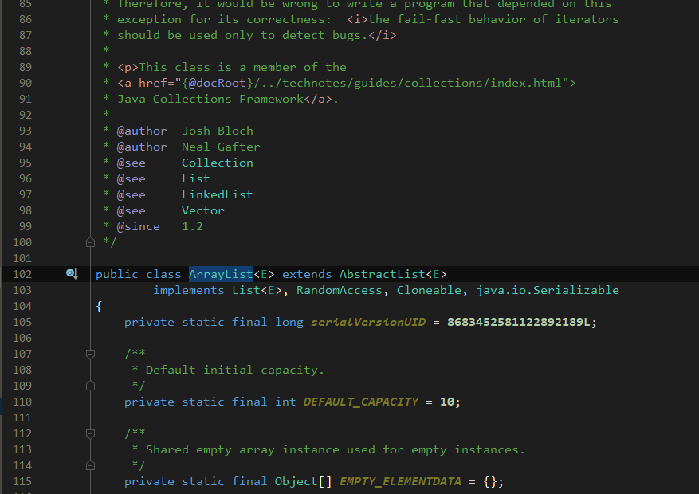
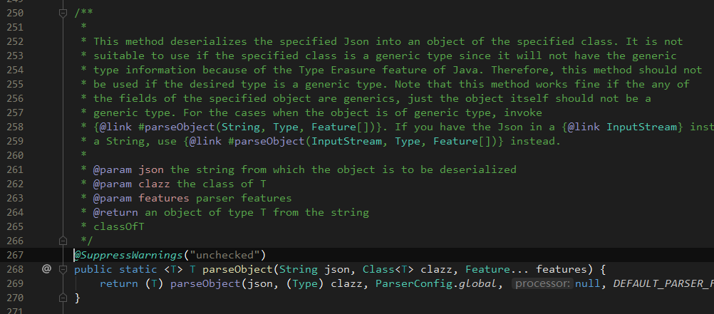
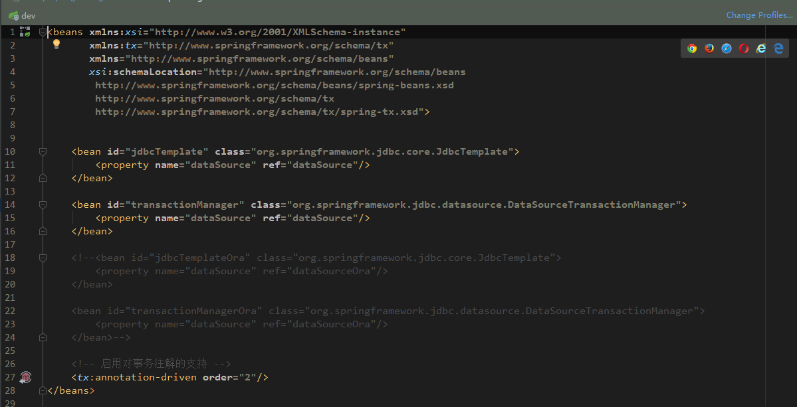

# vscode-2013 color Schemes for the JetBrains IntelliJ Platform

## sample
### java

 

### xml

## installtion
* Download Visual Studio 2013.icls and copy it into the colors/ directory in the IntelliJ preferences folder. In OS X: ~/Library/Preferences/IntelliJIdea12/colors/.
* You can also import the color scheme in the IDE:
    * settings>>Editor>>Color Scheme>>click the option>>Import Scheme>> then choose the icls file which you download 

